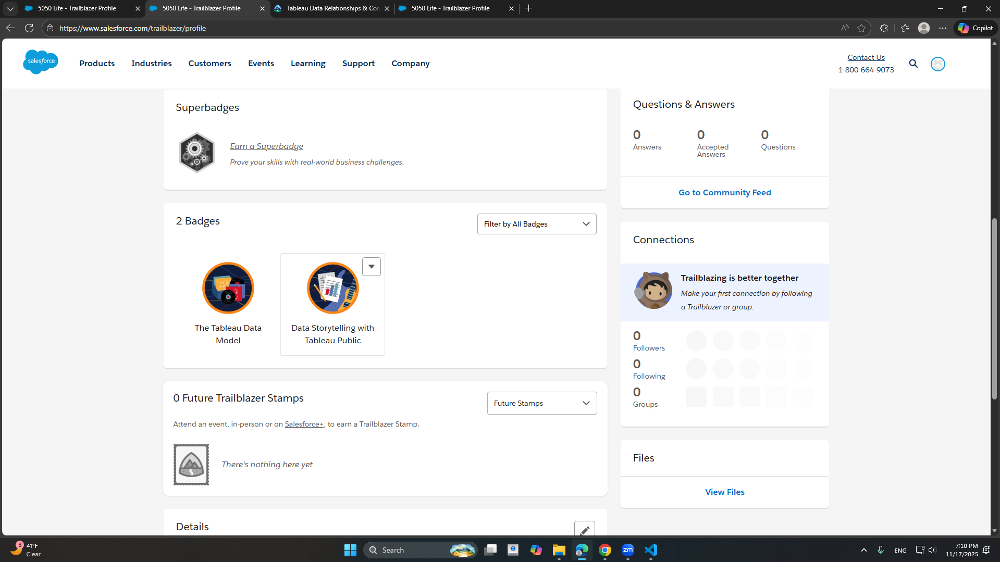

# tableau_trailhead_basics
## HHA 507 Assignment 6

# Reflection:
An idea from Data Storytelling with Tableau Public that has resonated with me is keeping the message concentrated, which prompted me to construct my visualization around a single clear takeaway rather than scattering the viewer's attention. The Tableau Data Model emphasized the importance of using relationships rather than traditional joins because connections retain each table at its natural level of information and eliminate untidy duplications, which are common in real-world healthcare datasets. This is important because healthcare data typically spans numerous tables (visits, labs, diagnoses, and outcomes), and imposing joins too early can distort the figures. A excellent healthcare example would be tracking chronic disease outcomes, where patient visits, lab values, and medication histories are stored in distinct tables; Tableau's data architecture can elegantly combine them, while the storytelling component helps emphasize which patient groups require attention.  It's a configuration that makes complex data easier to examine, interpret, and act upon.

### Trailhead Badges:

### Link to viz3 : <https://public.tableau.com/views/MyFirstVizonTableauPublic_17629914171700/Sheet1?:language=en-US&:sid=&:redirect=auth&:display_count=n&:origin=viz_share_link>
Preview Image: 

### Link to viz2 : <https://public.tableau.com/views/DataandRelate/Sheet1?:language=en-US&:sid=&:redirect=auth&:display_count=n&:origin=viz_share_link>
